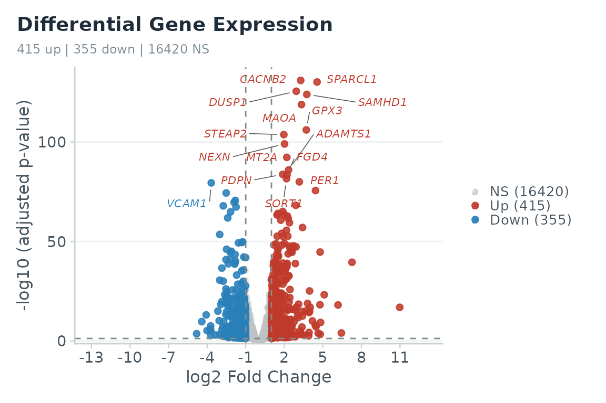

# Getting started with RNAmel

RNAmel is a downstream bulk RNA-seq analysis platform, usable either as
an interactive Shiny app
([`run_app()`](https://KmBioChemo.github.io/RNAmel/reference/run_app.md))
or as a set of pure, scriptable functions. This vignette is a
**reproducible reference analysis**: the core steps below run on a
bundled, published dataset so you can reproduce a real result end to
end.

``` r

library(RNAmel)
```

## The data

The package bundles two real, published human datasets. Here we use
**airway** (Himes *et al.* 2014): airway smooth-muscle cells treated
with dexamethasone vs. control across four cell lines.

``` r

counts <- read_counts(system.file("extdata", "demo_airway_counts.csv",
                                  package = "RNAmel"))
meta   <- read_metadata(system.file("extdata", "demo_airway_metadata.csv",
                                    package = "RNAmel"),
                        counts_samples = colnames(counts))
dim(counts)
#> [1] 17190     8
head(meta)
#>       sample condition    cell
#> 1 SRR1039508   Control  N61311
#> 2 SRR1039509       Dex  N61311
#> 3 SRR1039512   Control N052611
#> 4 SRR1039513       Dex N052611
#> 5 SRR1039516   Control N080611
#> 6 SRR1039517       Dex N080611
```

[`read_counts()`](https://KmBioChemo.github.io/RNAmel/reference/read_counts.md)
and
[`read_metadata()`](https://KmBioChemo.github.io/RNAmel/reference/read_metadata.md)
run strict validation and fail fast with an explicit message on
malformed input (negative values, duplicate gene IDs, missing rownames,
sample mismatch, …).

## Differential expression

We model expression as a function of `condition`, adjusting for the
paired `cell` line, and contrast dexamethasone (`Dex`) against
`Control`.

``` r

res <- run_deseq2(
  counts, meta,
  design   = ~ cell + condition,
  contrast = c("condition", "Dex", "Control"),
  shrink   = TRUE            # apeglm LFC shrinkage, Wald stat preserved
)
#> converting counts to integer mode
head(res[order(res$padj), ])
#>         gene   baseMean log2FoldChange     lfcSE     stat        pvalue
#> 6538  CACNB2   495.3581       3.275664 0.1326449 24.80377 8.163663e-136
#> 3979 SPARCL1   997.6038       4.550562 0.1865863 24.70052 1.055901e-134
#> 1056   DUSP1  3410.8040       2.933081 0.1219507 24.24829 6.893203e-130
#> 234   SAMHD1 12705.8482       3.753364 0.1576715 24.08727 3.398689e-128
#> 1618    MAOA  2343.3913       3.336101 0.1430166 23.58574 5.398708e-123
#> 253     GPX3 12292.3589       3.711423 0.1692351 22.30297 3.457747e-110
#>               padj
#> 6538 1.240060e-131
#> 3979 8.019566e-131
#> 1056 3.490258e-126
#> 234  1.290652e-124
#> 1618 1.640128e-119
#> 253  8.753862e-107
sum(res$padj < 0.05 & abs(res$log2FoldChange) > 1, na.rm = TRUE)  # sig genes
#> [1] 770
```

## Visualize

``` r

fig_volcano(res, lfc_thr = 1, padj_thr = 0.05, n_label = 15,
            mode = "exploration")
#> Warning: Removed 2000 rows containing missing values or values outside the scale range
#> (`geom_point()`).
```



Every figure function takes a `mode = c("exploration", "publication")`
argument; publication mode uses 8-pt Helvetica, strict axes, and no
grid, ready for a figure panel. Interactive versions
([`fig_volcano_interactive()`](https://KmBioChemo.github.io/RNAmel/reference/fig_volcano_interactive.md),
[`fig_pca()`](https://KmBioChemo.github.io/RNAmel/reference/fig_pca.md),
[`fig_umap()`](https://KmBioChemo.github.io/RNAmel/reference/fig_umap.md),
…) return plotly widgets for exploration.

For a heatmap and a PCA / UMAP sample overview you also need a
normalized matrix:

``` r

vst <- normalize_counts(counts, meta, method = "vst")
fig_heatmap(vst, res = res, metadata = meta, n_genes = 40)
fig_pca(vst, meta, n_top = 500, color_by = "condition")
fig_umap(vst, meta, color_by = "condition")            # non-linear embedding
```

## Downstream analyses

The heavier steps depend on optional (Bioconductor) packages and network
resources, so they are shown here rather than executed. All work from
the same `res` / `vst` objects and take an `organism` of `"human"`,
`"mouse"`, or `"rat"`.

``` r

# Functional enrichment: GSEA (whole ranked list) and ORA (significant genes)
gene_sets <- get_gene_sets("human", collection = "H")     # MSigDB Hallmark
gsea <- run_gsea(res, gene_sets, rank_by = "stat")
fig_enrich_dot(gsea)

sig <- contrast_sig_genes(res, padj_thr = 0.05, lfc_thr = 1)
ora <- run_ora(sig, "human", db = "GO", ont = "BP", universe = res$gene)
fig_enrich_bar(ora)

# Co-expression network (WGCNA)
datExpr <- wgcna_datexpr(vst, n_genes = 3000)
wg <- run_wgcna(datExpr, power = wgcna_pick_power(datExpr)$suggested)
fig_module_trait(module_trait_cor(wg$MEs, build_traits(meta, rownames(datExpr))))

# Regulator / pathway activity (decoupleR) and per-sample signatures (GSVA)
fig_activity_bar(run_activity(res, "human", what = "pathway"))
fig_gsva_heatmap(run_gsva(vst, gene_sets), meta)
```

## Sessions and reports

Bundle the whole analysis state into a single `.rnaflow.rds` file, and
export a reproducible R script and a self-contained HTML report (no
pandoc/Quarto required):

``` r

p <- assemble_project(
  "airway_study", organism = "human",
  counts = counts, metadata = meta,
  contrasts = contrast_store_upsert(list(), "Dex vs Control", res))
save_project(p, "airway_study.rnaflow.rds")

cat(generate_r_script(p), file = "analysis.R")   # runnable Methods script
build_report_html(p, "report.html")              # one-file HTML report
```

## Learn more

Everything above is also available point-and-click in the app:

``` r

run_app()
```

See the [package website](https://KmBioChemo.github.io/RNAmel/) for the
full function reference and the README for the feature overview.
